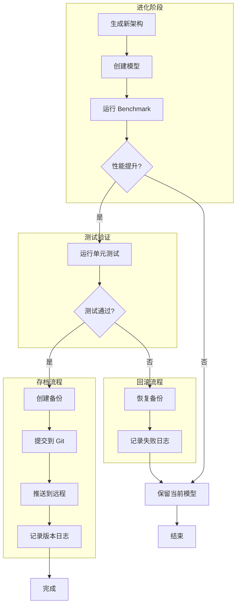
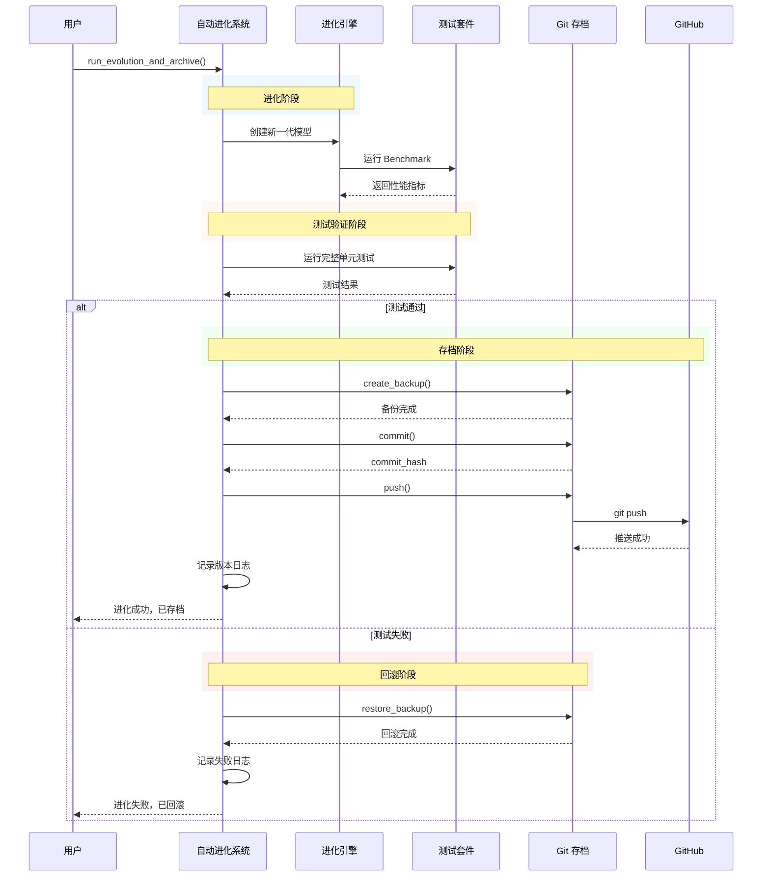

# Twistor-LNN 自动进化系统扩展计划

## 一、现有系统分析

当前系统已有两个核心模块：

### 1.1 auto_evolution.py (已实现)

| 组件 | 状态 | 功能 |
|------|------|------|
| BenchmarkSuite | ✅ | 测试基准套件 |
| 测试任务 | ✅ | sine_forecast, lorenz, stability, speed |
| ArchitectureSearchSpace | ✅ | 参数搜索空间 |
| EvolutionaryOptimizer | ✅ | 遗传算法优化 |
| AutoEvolutionSystem | ✅ | 进化系统封装 |

### 1.2 auto_archive.py (已实现)

| 组件 | 状态 | 功能 |
|------|------|------|
| GitArchiveSystem | ✅ | Git 存档系统 |
| run_tests | ✅ | 运行测试验证 |
| create_backup | ✅ | 创建备份 (用于回滚) |
| restore_backup | ✅ | 恢复备份 (回滚) |
| archive | ✅ | 完整存档流程 |
| commit & push | ✅ | 提交并推送到远程 |

---

## 二、本次扩展目标

### 2.1 自动 GitHub 存档和回滚 (本次重点)

```
模型进化 → 测试验证 → 通过则存档 → 失败则回滚
```

**功能需求**:
- [ ] 自动执行进化测试
- [ ] 测试通过则自动提交并推送
- [ ] 测试失败则自动回滚到上一版本
- [ ] 保留版本历史记录

### 2.2 反馈控制循环 (后续)

```
当前状态 → 性能监控 → 参数调整 → 新参数
```

**需要实现**:
- [ ] 运行时性能监控器
- [ ] 参数自适应调整器
- [ ] 在线学习/微调接口

---

## 三、自动 GitHub 存档系统设计

### 3.1 工作流程



### 3.2 核心类设计

#### AutoArchiveWithEvolution (整合进化 + 存档)

```python
class AutoArchiveWithEvolution:
    """自动进化 + 存档系统"""
    
    def __init__(self, evolution_system: AutoEvolutionSystem, archive_system: GitArchiveSystem):
        self.evolution = evolution_system
        self.archive = archive_system
        self.version_history = []
    
    def evolve_and_archive(self, n_generations: int = 5, device='cpu') -> bool:
        """
        进化 + 存档完整流程
        
        Returns:
            True: 进化成功且已存档
            False: 进化失败或测试失败，已回滚
        """
        print("=" * 70)
        print("开始自动进化 + 存档流程")
        print("=" * 70)
        
        # 1. 运行进化
        print("\n[1/4] 运行进化优化...")
        best_individual = self.evolution.run_evolution(
            n_generations=n_generations,
            device=device,
        )
        
        # 2. 创建备份
        print("\n[2/4] 创建备份...")
        old_commit = self.archive.create_backup()
        
        # 3. 运行完整测试
        print("\n[3/4] 运行完整测试...")
        test_passed, test_info = self.archive.run_tests()
        
        if not test_passed:
            print("\n✗ 测试失败，执行回滚")
            self.archive.restore_backup()
            self._log_failure(best_individual, test_info)
            return False
        
        # 4. 提交并推送
        print("\n[4/4] 提交并推送...")
        
        # 生成版本信息
        version = self._generate_version(best_individual)
        message = f"v{version}: 进化完成 - 适应度 {best_individual.fitness:.4f}"
        
        # 提交
        commit_hash = self.archive.commit(message)
        if not commit_hash:
            self.archive.restore_backup()
            return False
        
        # 推送
        push_success = self.archive.push()
        
        # 记录版本历史
        self._log_success(best_individual, commit_hash, version)
        
        return True
    
    def _generate_version(self, individual) -> str:
        """生成版本号"""
        # 格式: major.minor.patch
        # 基于适应度和配置生成版本
        fitness = individual.fitness
        return f"{int(fitness * 10):02d}.0.0"
    
    def _log_success(self, individual, commit_hash, version):
        """记录成功"""
        entry = {
            'version': version,
            'commit': commit_hash,
            'timestamp': datetime.now().isoformat(),
            'fitness': individual.fitness,
            'config': individual.config.to_dict(),
            'status': 'success',
        }
        self.version_history.append(entry)
        self._save_history()
    
    def _log_failure(self, individual, error_info):
        """记录失败"""
        entry = {
            'timestamp': datetime.now().isoformat(),
            'fitness': individual.fitness,
            'error': error_info,
            'status': 'failed',
        }
        self.version_history.append(entry)
        self._save_history()
```

### 3.3 版本管理

#### ModelVersion 类

```python
@dataclass
class ModelVersion:
    """模型版本"""
    version: str
    commit: str
    timestamp: str
    fitness: float
    config: Dict
    status: str  # 'success' or 'failed'
    benchmarks: Dict[str, float] = field(default_factory=dict)


class VersionManager:
    """版本管理器"""
    
    def __init__(self, storage_path: str = 'versions'):
        self.storage_path = Path(storage_path)
        self.storage_path.mkdir(exist_ok=True)
        self.versions: List[ModelVersion] = []
        self._load_history()
    
    def save_version(self, version: ModelVersion):
        """保存版本"""
        self.versions.append(version)
        
        # 保存到文件
        version_file = self.storage_path / f"{version.version}.json"
        with open(version_file, 'w') as f:
            json.dump({
                'version': version.version,
                'commit': version.commit,
                'timestamp': version.timestamp,
                'fitness': version.fitness,
                'config': version.config,
                'status': version.status,
                'benchmarks': version.benchmarks,
            }, f, indent=2)
    
    def load_version(self, version: str) -> Optional[ModelVersion]:
        """加载版本"""
        version_file = self.storage_path / f"{version}.json"
        if not version_file.exists():
            return None
        
        with open(version_file, 'r') as f:
            data = json.load(f)
            return ModelVersion(**data)
    
    def get_latest_success_version(self) -> Optional[ModelVersion]:
        """获取最新的成功版本"""
        success_versions = [v for v in self.versions if v.status == 'success']
        if success_versions:
            return success_versions[-1]
        return None
    
    def rollback_to_version(self, version: str) -> bool:
        """回滚到指定版本"""
        target = self.load_version(version)
        if not target:
            print(f"版本 {version} 不存在")
            return False
        
        # 使用 git 回滚
        try:
            subprocess.run(['git', 'checkout', target.commit], check=True)
            print(f"已回滚到版本 {version}")
            return True
        except Exception as e:
            print(f"回滚失败：{e}")
            return False
```

---

## 四、执行流程设计

### 4.1 完整执行流程



### 4.2 命令行接口

```bash
# 完整流程：进化 + 测试 + 存档
python auto_archive.py --evolve --generations 5 --message "v0.5.0 进化完成"

# 仅进化 (不存档)
python auto_archive.py --evolve --generations 5

# 仅存档 (不进化)
python auto_archive.py --archive --message "v0.4.0 完成"

# 回滚到指定版本
python auto_archive.py --rollback-to v0.4.0

# 查看版本历史
python auto_archive.py --versions

# 显示状态
python auto_archive.py --status
```

---

## 五、测试基准扩展

### 5.1 现有测试

| 测试 | 指标 | 目标 |
|------|------|------|
| sine_forecast | MSE | < 0.01 |
| stability | score | = 1.0 |
| inference_speed | time | < 0.1s |

### 5.2 需要添加的测试

| 测试 | 指标 | 目标 | 状态 |
|------|------|------|------|
| text_inference | perplexity | 持续下降 | 待添加 |
| lorenz_forecast | MSE | < 0.1 | 已实现 |
| convergence | epochs | 越来越少 | 待添加 |

---

## 六、风险与缓解

| 风险 | 缓解措施 |
|------|----------|
| 进化方向迷失 | 设置明确的适应度函数和目标 |
| 存档失败 | 保留备份，可随时回滚 |
| 过拟合到测试基准 | 定期更新测试集 |
| 网络问题导致推送失败 | 本地保留提交，手动推送 |

---

## 七、实现计划

### 阶段 1: 整合进化 + 存档 (Day 1)

| 任务 | 文件 | 说明 |
|------|------|------|
| AutoArchiveWithEvolution 类 | `auto_archive.py` | 整合进化和存档 |
| VersionManager 类 | `auto_archive.py` | 版本管理 |
| 命令行参数 | `auto_archive.py` | 添加 --evolve 参数 |

### 阶段 2: 扩展测试基准 (Day 2)

| 任务 | 文件 | 说明 |
|------|------|------|
| 添加文本推理测试 | `auto_evolution.py` | perplexity 测试 |
| 添加收敛测试 | `auto_evolution.py` | 收敛速度测试 |

### 阶段 3: 版本历史和回滚 (Day 3)

| 任务 | 文件 | 说明 |
|------|------|------|
| 版本历史记录 | `auto_archive.py` | JSON 格式存储 |
| 回滚到指定版本 | `auto_archive.py` | git checkout |

### 阶段 4: 持续集成测试 (Day 4)

| 任务 | 文件 | 说明 |
|------|------|------|
| CI 测试流程 | `.github/workflows/` | GitHub Actions |
| 自动触发进化 | `.github/workflows/` | 定时任务 |

---

## 八、验收标准

### 功能验收

- [ ] `python auto_archive.py --evolve` 可正常运行完整流程
- [ ] 测试通过后自动提交并推送到 GitHub
- [ ] 测试失败后自动回滚
- [ ] 版本历史正确记录

### 性能验收

- [ ] 每次进化后适应度不下降
- [ ] 回滚操作 < 5 秒完成
- [ ] 存档操作 < 30 秒完成

---

**计划创建时间**: 2026-03-30  
**预计完成时间**: 4 天
